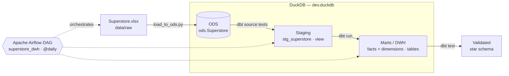
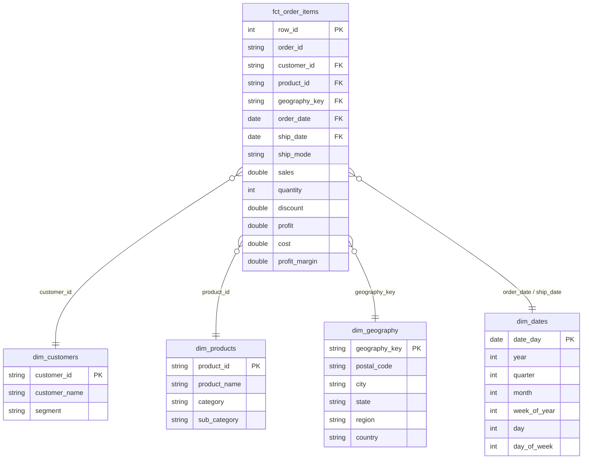

# Superstore Data Warehouse — Airflow · dbt · DuckDB

[](../../actions/workflows/ci.yml)


An end-to-end, containerized ELT pipeline that turns the raw **Sample Superstore** Excel dataset into a tested **star-schema data warehouse**.
Apache Airflow orchestrates the pipeline, dbt models and tests the data, and DuckDB serves as the analytical database.

---

## Architecture



| Layer   | Schema     | Materialization | Purpose                                          |
|---------|------------|-----------------|--------------------------------------------------|
| ODS     | `ods`      | table           | Raw copy of the Excel file, loaded as-is         |
| Staging | `main_stg` | view            | Renamed, typed and standardized columns          |
| Marts   | `main_dwh` | table           | Star schema (fact + dimensions) for analytics    |

## Airflow DAG

`superstore_dwh` runs daily and executes:

```
dbt_debug  →  load_to_ods  →  dbt_test_sources  →  dbt_run  →  dbt_test
```

| Task               | Description                                             |
|--------------------|---------------------------------------------------------|
| `dbt_debug`        | Validates the dbt profile and DuckDB connection         |
| `load_to_ods`      | Loads `Superstore.xlsx` into `ods.Superstore`           |
| `dbt_test_sources` | Runs data tests on the ODS source before transforming   |
| `dbt_run`          | Builds the staging views and mart tables                |
| `dbt_test`         | Runs all model tests (uniqueness, nulls, relationships) |

dbt runs in its own virtualenv inside the Airflow image so its dependencies never conflict with Airflow's.

## Data Model



**Data quality:** 35 dbt tests cover primary-key uniqueness, not-null constraints, accepted values and referential integrity between the fact table and every dimension.

## Project Structure

```
.
├── .github/workflows/ci.yml     # CI: load data + dbt build on every push / PR
├── airflow/
│   ├── dags/
│   │   └── superstore_dwh_dag.py  # Pipeline orchestration
│   ├── Dockerfile               # Airflow 3.1 image + isolated dbt virtualenv
│   ├── docker-compose.yml       # Local Airflow (standalone mode)
│   └── requirements-dbt.txt     # dbt / DuckDB versions used inside the image
├── data/
│   └── raw/Superstore.xlsx      # Source dataset
├── dbt_project/
│   ├── models/
│   │   ├── staging/             # Source definitions + stg_superstore
│   │   └── marts/
│   │       ├── dimensions/      # dim_customers, dim_products, dim_geography, dim_dates
│   │       └── facts/           # fct_order_items
│   ├── dbt_project.yml
│   ├── packages.yml             # dbt_utils
│   └── profiles.yml             # DuckDB connection (local file, no secrets)
├── scripts/
│   └── load_to_ods.py           # Excel → DuckDB ODS loader
├── Makefile                     # Shortcuts for common commands
└── requirements.txt             # Local Python dependencies
```

## Getting Started

### Prerequisites

- [Docker](https://docs.docker.com/get-docker/) and Docker Compose (to run Airflow)
- Python 3.11 (to run dbt locally without Airflow)

### Option 1 — Run with Airflow (Docker)

```bash
git clone https://github.com/<your-username>/<repo-name>.git
cd <repo-name>

cd airflow
docker compose up -d --build
```

1. Open the Airflow UI at **http://localhost:8080**. No login is needed; this is a local dev setup.
2. Unpause the `superstore_dwh` DAG and trigger a run.

### Option 2 — Run locally (no Docker)

```bash
python -m venv .venv && source .venv/bin/activate
make install   # pip install -r requirements.txt
make build     # load ODS → dbt deps → dbt build (run + test)
make docs      # browse lineage & docs at http://localhost:8081
```

Run `make help` to list every available command.

### Query the warehouse

```python
import duckdb

con = duckdb.connect("dbt_project/dev.duckdb", read_only=True)
con.sql("""
    select p.category, round(sum(f.sales), 2) as revenue, round(sum(f.profit), 2) as profit
    from main_dwh.fct_order_items f
    join main_dwh.dim_products p using (product_id)
    group by 1
    order by revenue desc
""").show()
```

## Tech Stack

| Tool           | Role                                  |
|----------------|---------------------------------------|
| Apache Airflow | Orchestration and scheduling          |
| dbt-core       | Transformations, testing, docs        |
| DuckDB         | Embedded analytical database          |
| dbt_utils      | Surrogate keys                        |
| Docker         | Reproducible Airflow environment      |
| GitHub Actions | Continuous integration                |

## Dataset

[Sample – Superstore](https://www.kaggle.com/datasets/vivek468/superstore-dataset-final) contains 9,994 order line items from a US retailer, covering 2014–2017.
